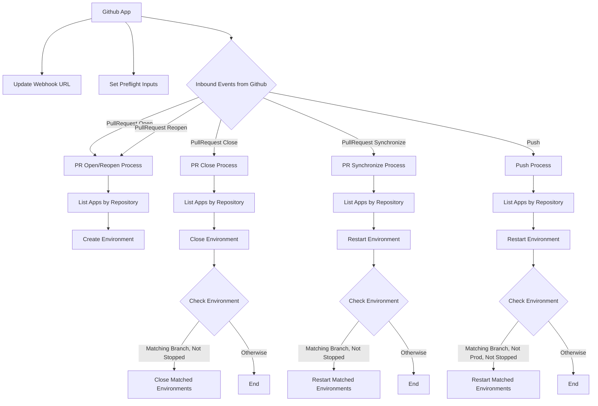

# Event Driven Architecture

This RFC proposes transitioning the architecture of wing.cloud from a monolithic, API-driven pattern to an event-driven model.

## Current State

Currently, we have a robust prototype primarily developed in Winglang. This application, aiming for production-level deployment to a broad customer base, has already made a positive impact during Eyal's workshop. While user-facing enhancements can always be improved, the primary challenges lie in the backend.

## Current Challenges

As the first major production application using Winglang, compromises were necessary for progress. The current system is akin to a distributed monolith regarding deployment, code architecture, and workflows. The existing codebase suffers from complexity, tight coupling of unrelated components (e.g., linking inbound Github events with environment creation on fly.io), and maintenance difficulties, especially for testing and long-term sustainability.

## Goals

- Streamline the mental model.
- Reduce component complexity.
- Facilitate easy addition, modification, and testing of individual components.

## Non-Goals

- Avoid a complete rewrite.
- Maintain the core data storage pattern; this does not aim to introduce Event Sourcing.
- Immediate alteration of the monolithic terraform deployment isn't critical; focus should be on functional aspects first.

## Future Use Cases

Possible future features for consideration:

- Diversifying triggers/sources beyond Github (e.g., file uploads, Gitlab).
- Expanding deployment targets to include shared or customer-owned AWS accounts and other cloud providers.
- Implementing usage/billing systems.
- Enhancing authorization features.
- Developing custom services to support the Wing Framework SDK in Cloudlets.

## Existing Workflows

- [Pull Request Open / Reopen](../workflows/gitihub-pull-request-open.md)

### Github App

#### Preflight Sideffects

- Update Webhook Url (on Deploy)

#### Preflight Inputs

- Github App ID
- Github Private Key
- Runtime url (fly.io) - (not used?)
- Apps table
- Users table (not used?)
- Environment Manager
- Environments

#### Inbound Events from Github

- PullRequest Open
- PullRequest Close
- PullRequest Reopened
- PullRequest Synchronize
- push

##### PullRequest Open / Reopened

- Apps#listByRepository (DDB Table)
- Create Environment (Environment Manager) for branch

##### PullRequest Close

- Apps#listByRepository (DDB Table)
- Close Environment (Environment Manager)
  - for each environment found which is
  - matching the event branch
  - not stopped

##### PullRequest Synchronize

- Apps#listByRepository (DDB Table)
- Restart Environment (Environment Manager)
  - for each environment found which is
  - matching the event branch
  - not stopped

##### Push

- Apps#listByRepository (DDB Table)
- Restart Environment (Environment Manager)
  - for each environment found which is
  - matching the event branch
  - not "production" environment type
  - not stopped

#### Diagram

Generated from above

### Environment Manager

### Secrets

### Runtime (flyio)

### API

### Dnsimple / Reverse Proxy

### Logs

### Notifications

## Proposal

We aim to define and agree on a unified vision for system development. This initial proposal outlines broad ideas rather than a detailed plan:

- List and segregate services (e.g., Github event handling, environment management, secret storage).
- Clarify boundaries within the Wing modules, transforming them into distinct services.
- Implement orchestration within services and use events for inter-service coordination.

### Implementation Notes

For AWS, we can utilize [Eventbridge](https://aws.amazon.com/eventbridge/). For SIM, a simple event bus might be necessary. The extent of integration without support from the Wing framework, especially in the Wing console UI, is uncertain.

## Why Now?

Focusing on foundational robustness rather than feature expansion is more beneficial at this early stage. Implementing such fundamental changes becomes increasingly challenging over time.

## Further Reading Material

- Check out the 2023 updated version of my favorite reinvent talk, serverlesspresso, at https://www.youtube.com/watch?v=cOQClEYryvU. It provides an excellent overview of these concepts.
- Visit https://aws.amazon.com/what-is/eda/ for more on event-driven architecture.
