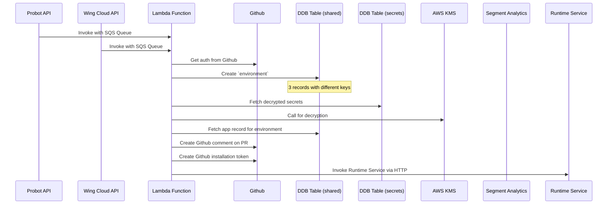

# Environment Manager (Create)

## Taxonomy

- Environment: a space with a stable address where an instance of the application is deployed. In v1.0 each app can have multiple preview environments (associated with PR branches) and a single production environment (associated with the main branch of the repository).
- Environment Type: for v1.0 we have only preview and production.
- Branch: a git repository branch. Each environment tracks a particular git branch.
- Preview: a type of an ephemeral environment which can be deployed ad-hoc and cleaned up quickly.

## Invoked From

- Probot API (via SQS Queues)
- Wing Cloud API (via SQS Queues)

## External Systems

- Github (auth)
- DDB Table (shared)
- DDB Table (secrets)
- AWS KMS
- Wing Cloud API
- Segment Analytics
- Runtime Service

## Data

- Config Values (ENV)
- Secrets (Disk, mounted volume?)
- Git Repository

## Event Flow

- lambda: Get auth from Github
- lambda: Create `environment` in Dynamodb Table
  - 3 almost identicial records are written with different primary key / sort key combinations
- lambda: Decrypted secrets are fetched for the environment type
  - Secrets are a dedicted DynamoDB table
  - For decryption, KMS is called
- lambda: App recrod is fetched for the created environment
- lambda: A github comment is created on the Pull Request
- lambda: A Github installation token is created for the runtime
- lambda: Call create runtime in Runtime Service from SQS Queue
- lambda: The [Runtime Service](./runtime-service.md) is invoked via HTTP

