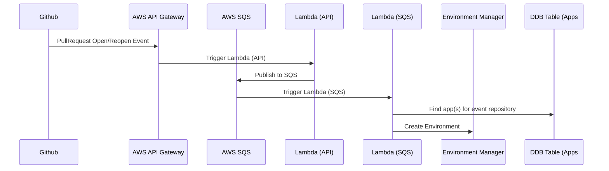

# Github Event PullRequest Open / Reopen

## Taxonomy

- Environment: a space with a stable address where an instance of the application is deployed. In v1.0 each app can have multiple preview environments (associated with PR branches) and a single production environment (associated with the main branch of the repository).
- Environment Type: for v1.0 we have only preview and production.
- Branch: a git repository branch. Each environment tracks a particular git branch.
- Preview: a type of an ephemeral environment which can be deployed ad-hoc and cleaned up quickly.

## External Systems

- Github (event source, comment / status update target)
- AWS Api Gateway
- AWS SQS
- Inlined Environment Manager

## Data

## Event Flow

- API Gateway: Github Event PullRequest Open
- Lambda (api): Publish to SQS
- Lambda (sqs): Find app(s) for event repository (Apps#listByRepository (DDB Table))
- Lambda (sqs): Create Environment ([Environment Manager](./environment-management.md))

## Sequence Diagram

