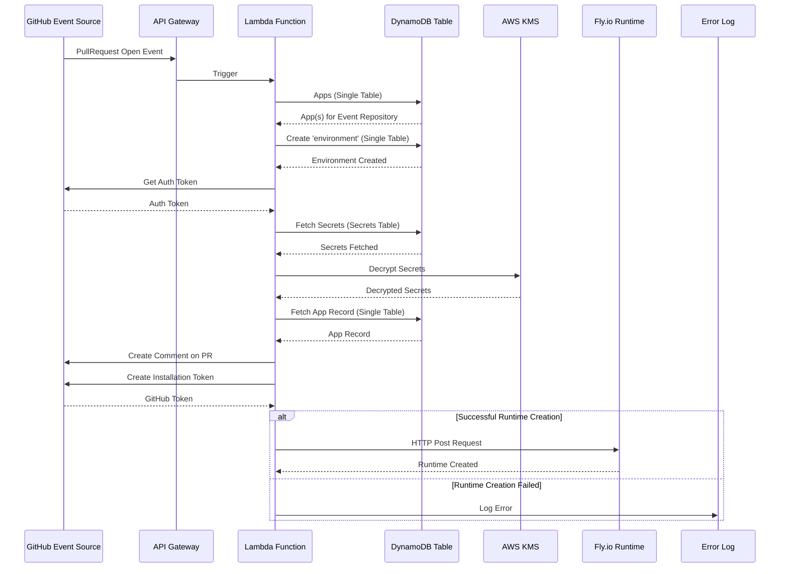

# Github Event PullRequest Open / Reopen

## Taxonomy

- Environment: a space with a stable address where an instance of the application is deployed. In v1.0 each app can have multiple preview environments (associated with PR branches) and a single production environment (associated with the main branch of the repository).
- Environment Type: for v1.0 we have only preview and production.
- Branch: a git repository branch. Each environment tracks a particular git branch.
- Preview: a type of an ephemeral environment which can be deployed ad-hoc and cleaned up quickly.

## External Systems

- Github (event source, comment / status update target)
- Fly.io (runtime)

## Data

- DynamoDB Tables
  - Apps
  - Environments
  - Users
- Secrets
- Config values
- Runtime Wildcard SSL certificate

## Event Flow

- API Gateway: Github Event PullRequest Open
- Lambda: Find app(s) for event repository (Apps#listByRepository (DDB Table))
- Lambda: Create Environment (Environment Manager) for app with branch
- Lambda: Get auth token from Github for app
- Lambda: Create `environment` in Dynamodb Table
  - 3 almost identicial records are written with different primary key / sort key combinations
- Lambda: Decrypted secrets are fetched for the environment type
  - Secrets are a dedicted DynamoDB table
  - For decryption, KMS is called
- Lambda: App recrod is fetched for the created environment
- Lambda: A github comment is created on the Pull Request
- Lambda: A Github installation token is created for the runtime
- Lambda: The fly.io runtime is created via a http post request passing along the data priorly collected, an error is logged if unsuccessful

## Sequence Diagram

