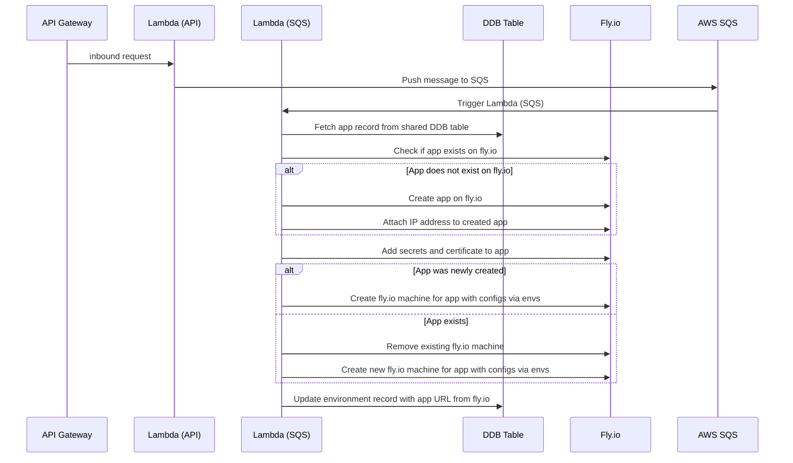

# Runtime Service

## Taxonomy

- Environment: a space with a stable address where an instance of the application is deployed. In v1.0 each app can have multiple preview environments (associated with PR branches) and a single production environment (associated with the main branch of the repository).
- Environment Type: for v1.0 we have only preview and production.
- Branch: a git repository branch. Each environment tracks a particular git branch.
- Preview: a type of an ephemeral environment which can be deployed ad-hoc and cleaned up quickly.

## Invoked From

- Environment Manager via Rest API Gateway

## External Systems

- Github (auth)
- DDB Table (shared)
- Fly.io (runtime)
- AWS SQS
- AWS Api Gateway

## Data

- Config Values (ENV)
- Secrets
- Certificate
- Git Repository
- Runtime Docker image

## Event Flow

- api gateway: inbound request
- lambda (api): Push message to SQS
- lambda (sqs): Fetch app record from shared DDB table
- lambda (sqs): Check if app exists on fly.io
- lambda (sqs): If not:
  - Create app on fly.io
  - Attach IP address to created app on fly.io
- lambda (sqs): Add secrets and certificate to created app on fly.io
- lambda (sqs): if app was newly created:
  - create fly.io machine for app with added configs via envs
- lambda (sqs): otherwise:
  - remove existing fly.io machine
  - create fly.io machine for app with added configs via envs
- lambda (sqs): update environment record with app url from fly.io

