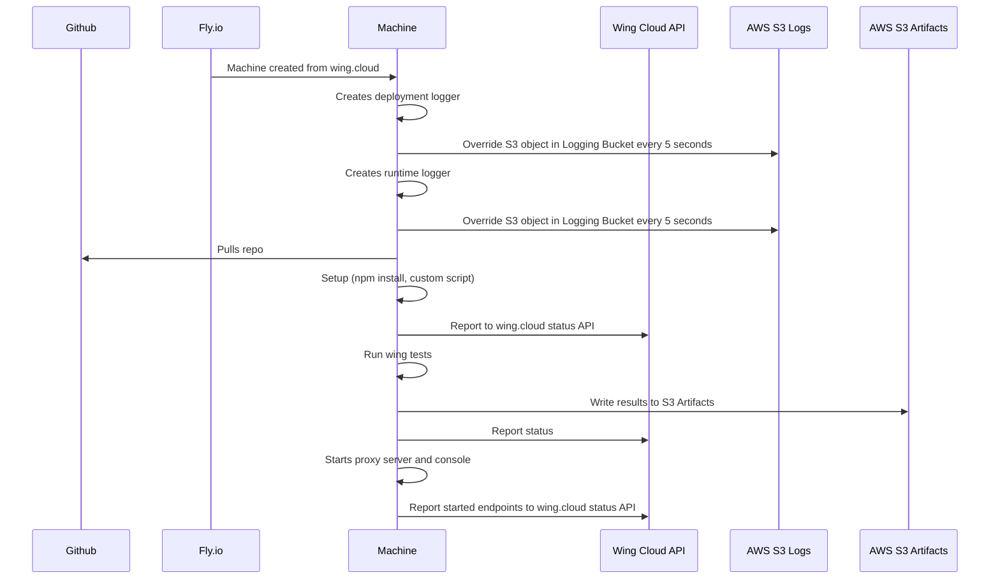

# Runtime Setup and Execution

## Taxonomy

- Environment: a space with a stable address where an instance of the application is deployed. In v1.0 each app can have multiple preview environments (associated with PR branches) and a single production environment (associated with the main branch of the repository).
- Environment Type: for v1.0 we have only preview and production.
- Branch: a git repository branch. Each environment tracks a particular git branch.
- Preview: a type of an ephemeral environment which can be deployed ad-hoc and cleaned up quickly.

## External Systems

- Github (source code)
- Fly.io (runtime)
- Wing Cloud API
- AWS S3 Logs
- AWS S3 Artifacts

## Data

- Config Values (ENV)
- Secrets (Disk, mounted volume?)
- Git Repository

## Event Flow

- fly.io: Machine created from wing.cloud
- machine: creates deployment logger (buffer to file, override S3 object in Logging Bucket every 5 seconds)
- machine: creates runtime logger (buffer to file, override S3 object in Logging Bucket every 5 seconds)
- machine: Pulls repo from Github
- machine: Setup (npm install, custom script)
- machine: Report to wing.cloud status api
- machine: Run wing tests and write results as file to S3 Artifacts and report status to wing.cloud as well
- machine: Starts proxy server and console
- machine: Report started endpoints to wing.cloud status api

