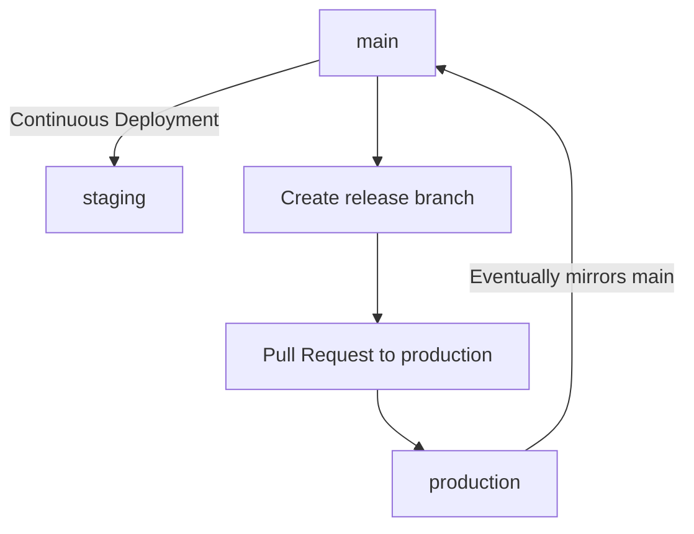
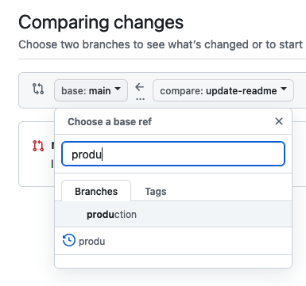
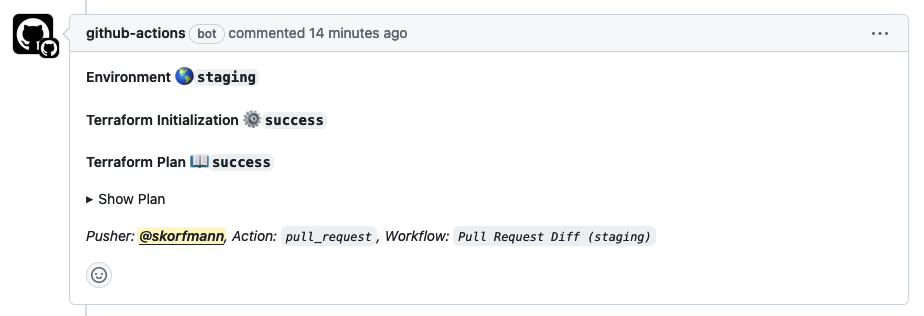

# `@wingcloud/monorepo`

> [!NOTE]
> We recommend installing these dependencies globally:
>
> - [@antfu/ni](https://github.com/antfu/ni): `pnpm install @antfu/ni --global`
> - [projen](https://github.com/projen/projen): `pnpm install projen --global`
> - [turbo](https://github.com/vercel/turbo): `pnpm install turbo --global`

## Setup

Install the dependencies:

```sh
ni
```

Go to the `infrastructure` package:

```sh
cd apps/@wingcloud/infrastructure
```

Copy the `.env.example` file into `.env`:

```sh
cp .env.example .env
```

Complete the missing `.env` variables (commented variables are optional).

### Creating the App Secret

For the `APP_SECRET` and the `WS_SECRET` environment variables, you can generate a random string with the following command:

```sh
openssl rand -hex 32
```

### Creating the GitHub App

For the `BOT_GITHUB_*` variables, you'll need a [GitHub App](https://docs.github.com/en/apps/creating-github-apps/registering-a-github-app/registering-a-github-app).

- The Homepage URL doesn't matter
- The Callback URL should be `http://localhost:3900/wrpc/github.callback`
- Enable `Request user authorization (OAuth) during installation`
- Enable the Webhook. The URL will be updated after the first deployment
- Set a Webhook Secret (e.g. `openssl rand -hex 32`). Remember to specify the webhook secret in the `.env` file
- Enable SSL verification
- The required permissions are:
  - Contents: Read Only
  - Issues: Read & Write
  - Metadata: Read Only
  - Pull Requests: Read & Write
  - Administration: Read & Write
- The required events are:
  - Pull Request
  - Push

## Dev

Now, run the `dev` script:

```sh
nr dev
```

## Synthesize

After changing the `.projenrc.ts` file, you have to synthesize your project:

```sh
projen
```

## Update

Update dependencies from all packages:

```sh
pnpm up -r
projen
```

Check latest versions of dependencies:

```sh
pnpm up -riL
projen
```

## Deployments

Find all AWS environments over here: https://wingcloud.awsapps.com/start



### Staging

The [staging](https://staging.wingcloud.io) environment is deployed continously from the `main` branch. Pull requests targeting `main` will automatically create a Terraform diff and post it on the pull request itself. Please make sure it's reflecting what you're intending to change before merging to `main`.

### Production

The [production](https://wing.cloud) environment is _not_ continously deployed from `main` at the moment. Deployments are based on the `production` branch.

The `production` branch is supposed to eventually mirror `main`. This means, make sure that all new features / fixes are going through `main`.

#### Release Process

- make sure your on the `main` branch and it's up2date
- `git checkout -b release/my-new-release`
- `git push --set-upstream origin release/my-new-release`
- create a new pull request, change the base branch to `production`
- name the pull request: "release: my new release"
- wait for the Terraform production diff to be commented on the PR!
- make sure the Terraform plan applies cleanly and reflects the intended changes
- Merge with a _Merge Commit_ - don't squash - the pull request into `production`



